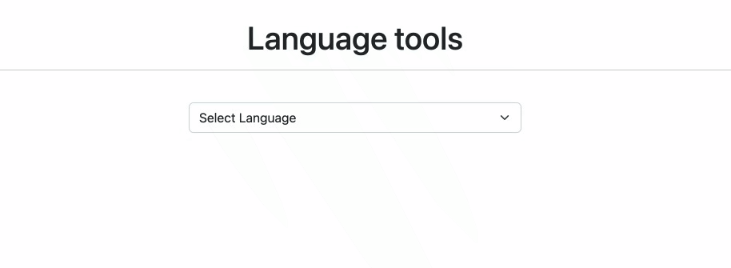
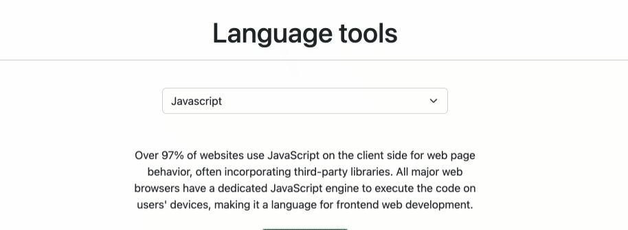
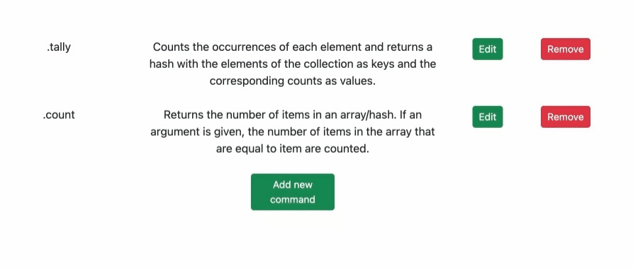
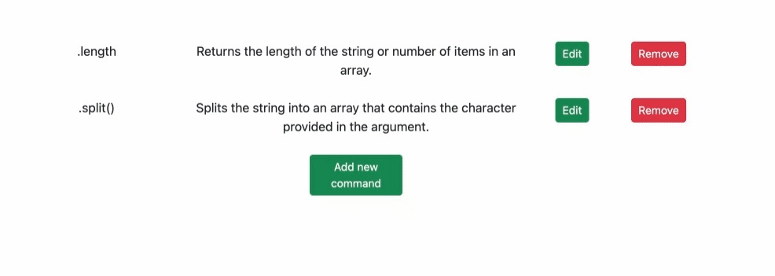
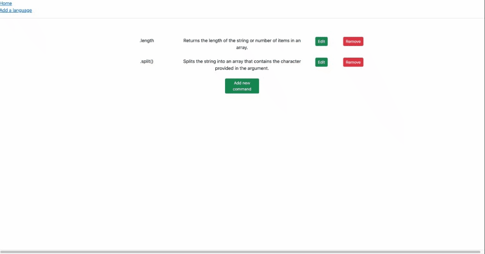
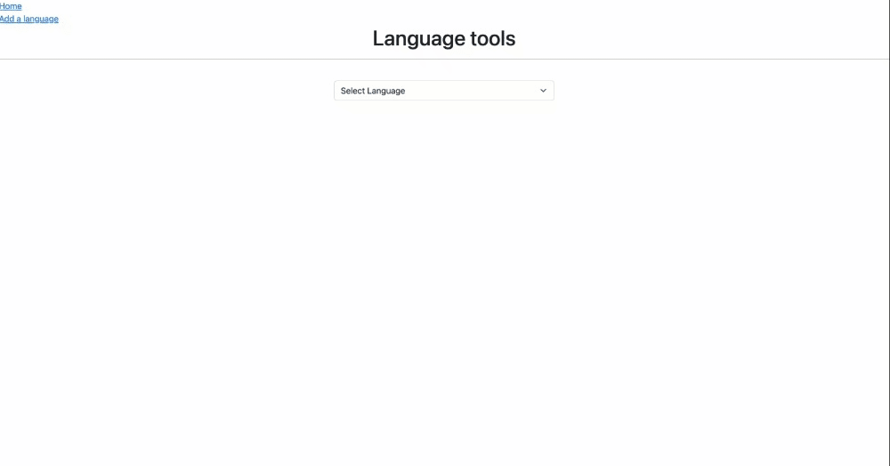

# Language Tools

This project is made to help coders store and remember useful commands to use for each language they know.

## Features

- View functions/methods per language
- Add a new language
- Add a new function
- Edit existing functions/methods
- Delete existing functions/methods

## How to Use

1. ***Select which language to view***
> 

2. ***Click `View Commands` to view all the commands for that language***
> 

3. ***Click `Add new command` to add a command for that specific language***
> 

4. ***Click `Edit` to edit the command and its description***
> 

5. ***Click `Remove` to delete the command***
> 

6. ***Click `Add a language` on the upper left of the screen to add a new language***
> 

## Technologies used

This app was made using:
- [Ruby](https://ruby-doc.org)
- [Sinatra](https://sinatrarb.com/)
- [React](https://reactjs.org/) 
- [React Bootstrap](https://react-bootstrap.github.io/)
- [React Router](https://reactrouter.com/)